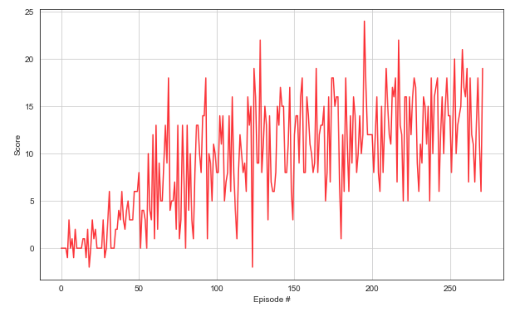

[//]: # (Image References)

[image1]: https://user-images.githubusercontent.com/10624937/42135619-d90f2f28-7d12-11e8-8823-82b970a54d7e.gif "Trained Agent"

# Project 1: Navigation

### Introduction

In this project the goal is to train an agent to navigate (and collect bananas!) in a large, square world.  

![Trained Agent][image1]

A reward of +1 is provided for collecting a yellow banana, and a reward of -1 is provided for collecting a blue banana.  Thus, the goal of your agent is to collect as many yellow bananas as possible while avoiding blue bananas.  

The state space has 37 dimensions and contains the agent's velocity, along with ray-based perception of objects around agent's forward direction.  Given this information, the agent has to learn how to best select actions.  Four discrete actions are available, corresponding to:
- **`0`** - move forward.
- **`1`** - move backward.
- **`2`** - turn left.
- **`3`** - turn right.

The task is episodic, and in order to solve the environment agent must get an average score of +13 over 100 consecutive episodes.

### Getting Started

1. Download the environment from one of the links below.  You need only select the environment that matches your operating system:
    - Linux: [click here](https://s3-us-west-1.amazonaws.com/udacity-drlnd/P1/Banana/Banana_Linux.zip)
    - Mac OSX: [click here](https://s3-us-west-1.amazonaws.com/udacity-drlnd/P1/Banana/Banana.app.zip)
    - Windows (32-bit): [click here](https://s3-us-west-1.amazonaws.com/udacity-drlnd/P1/Banana/Banana_Windows_x86.zip)
    - Windows (64-bit): [click here](https://s3-us-west-1.amazonaws.com/udacity-drlnd/P1/Banana/Banana_Windows_x86_64.zip)
    
    (_For Windows users_) Check out [this link](https://support.microsoft.com/en-us/help/827218/how-to-determine-whether-a-computer-is-running-a-32-bit-version-or-64) if you need help with determining if your computer is running a 32-bit version or 64-bit version of the Windows operating system.

    (_For AWS_) If you'd like to train the agent on AWS (and have not [enabled a virtual screen](https://github.com/Unity-Technologies/ml-agents/blob/master/docs/Training-on-Amazon-Web-Service.md)), then please use [this link](https://s3-us-west-1.amazonaws.com/udacity-drlnd/P1/Banana/Banana_Linux_NoVis.zip) to obtain the environment.

2. Place the file in the `Navigation/` folder, and unzip (or decompress) the file.

3. In addition, there is a `requirements.txt` file in the current folder that has all the packages required to run the code.

### Project Structure

This folder contains `Navigation.ipynb` Jupyter Notebook that has the solution. File `dqn_network.py` consists of Neural Network definition, file `dqn_agent.py` contains the agent. Both of the files are minor modifications of the code provided in the course.

**Details of Neural Network**

Since eating bananas is not very complicated task, strucure of Neural Network was not modified much as compare to the original (provided in the course material). There have been only 2 modifications made:
1. For each layer (except value function and advantage function) I've added Weight Normalization as described in this [paper](https://arxiv.org/pdf/1602.07868.pdf). This helped to improve the speed of convergence of the model. I've also experimented by adding Weight Normalization to value and advantage functions, but this did not result in any improvement.
2. Weights in each layer were initialized using Xavier's initialization (see [here](http://proceedings.mlr.press/v9/glorot10a/glorot10a.pdf)). This also helped the training. Again, initialization was not used for value and advantage functions.
3. Instead of Mean Squared Error Loss I've used Huber Loss as suggested [here](https://pytorch.org/tutorials/intermediate/reinforcement_q_learning.html#replay-memory). This turned out to work better than MSE loss, mainly because it is less sensitive to outliers.

In this project I've tried [DQN](https://www.nature.com/articles/nature14236) and [DDQN](https://arxiv.org/pdf/1511.06581.pdf)

As expected, DDQN worked better because the dueling architecture learnt which states are (or are not) valuable, without having to learn the effect of each action for each state.

DQN network has the following structure:

Layer 1: (state_size, 128) -> relu activation
Layer 2: (128, 64) -> relu activation
Layer 3: (64, action_size)

DDQN network's structure:

Layer 1: (state_size, 128) -> relu activation
Layer 2: (128, 64) -> relu activation
Layer 3: value_function(64, 1), adv_function(64, action_size)

output: value_function(x) + (adv_function(x) - adv_function(x).mean())

where `value_function()` is value function and `adv_function()` is advantage function from DDQN paper.

In addition to `relu()` activation, I've also tried `selu()` but it did not improve the performance.

**Results**

Using DDQN Neural Network we are able to solve this environment in less than 200 episodes (could be as little as 160 episodes). 

Figure below shows scores for number of episodes

**Future Improvements**
To improve this solution, we could implement a few more things:
1. Prioritized Experience Replay. This would allow for more intelligent sampling from the Memory Buffer. At the moment all experiences (represented as a tuple of state, next_state, reward, action and done) are sampled uniformly. Prioritized Experience would sample tuples that result in higher error (which means that we learn more from them) more often.
2. Noisy Network instead of epsilon-greedy policy. This would require to implement custom Linear layer in PyTorch (which is not hard) and remove all the epsilon-greedy related code from the current implimentation. This could improve learning process of the agent as shown in this [paper](https://arxiv.org/abs/1706.10295).
